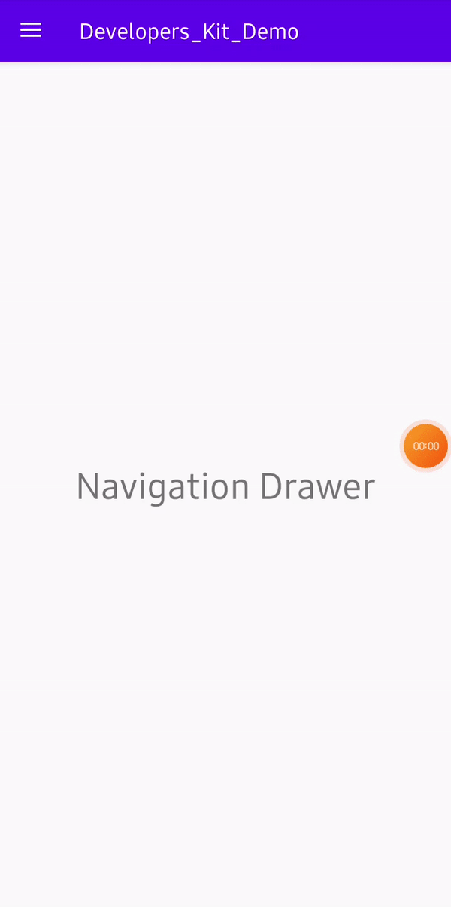

# Navigation_Drawer
The navigation drawer is a UI panel that shows your app's main navigation menu. The drawer appears when the user touches the drawer icon in the app bar or when the user swipes a finger from the left edge of the screen

